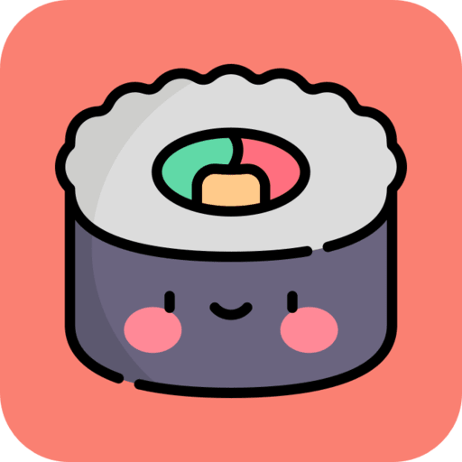
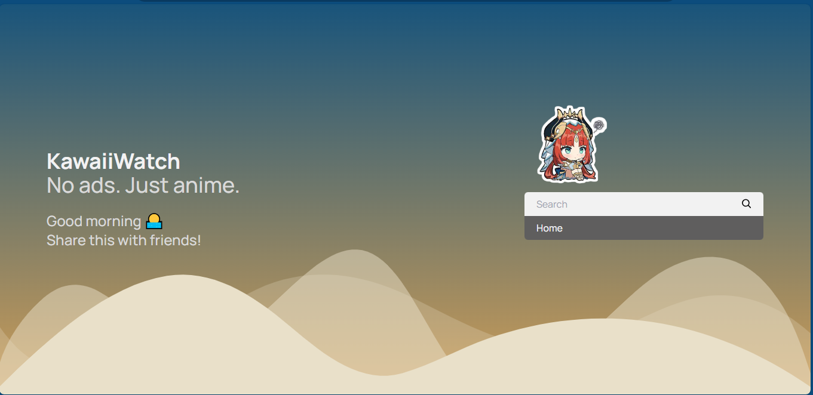
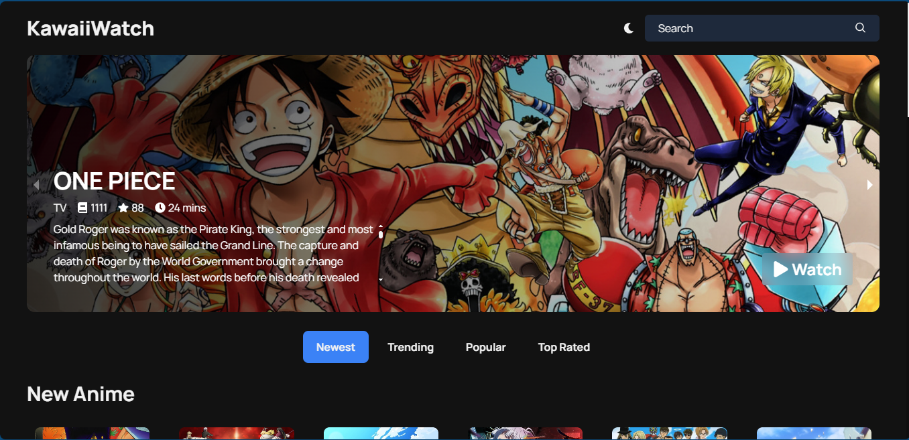
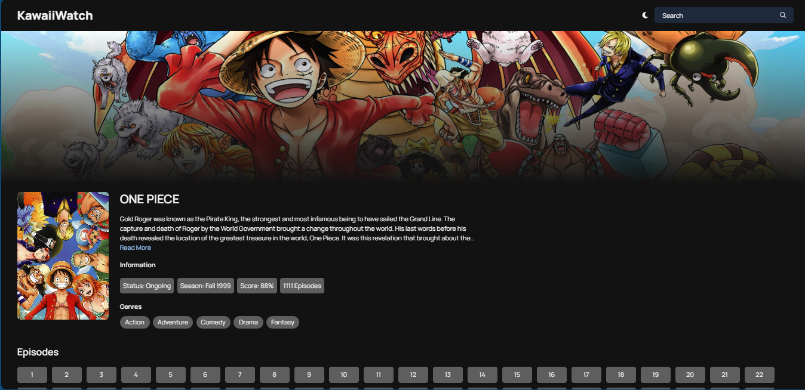
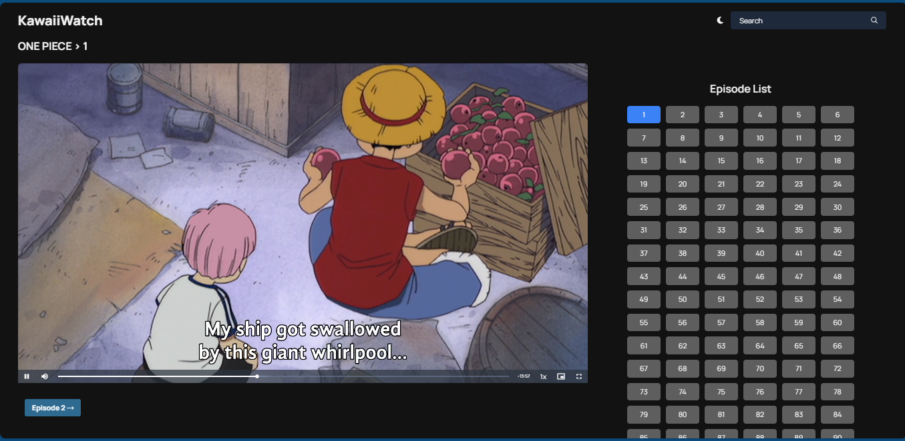
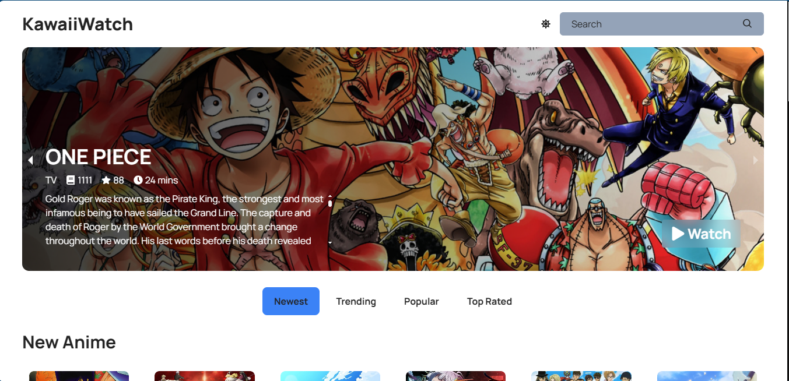
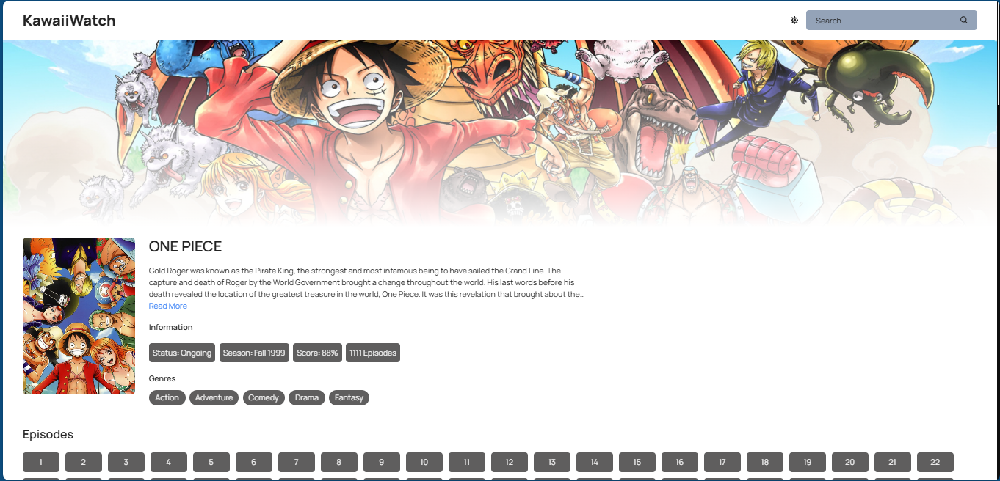
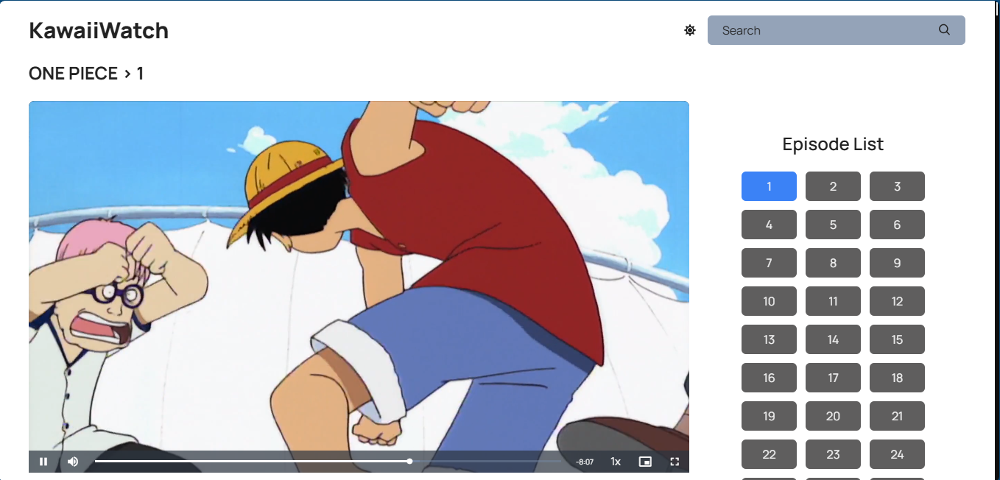

<div align="center">
<a href="https://https://anime.grezaski.xyz/">
  
<h1>KawaiiWatch</h1>
</a>
An ad-free anime streaming web app aimed at minimality and responsive design. 
<br />
</div>

## Images
<p align="center">
 
</p>

<details>
<summary>More Screenshots</summary>

<div align="center">

<h3 align="center">Anime Home Page (Dark Mode)</h3>


<h3 align="center">Anime Info Page (Dark Mode)</h3>


<h3 align="center">Anime Watch Page (Dark Mode)</h3>


<h3 align="center">Anime Home Page (Light Mode)</h3>


<h3 align="center">Anime Info Page (Light Mode)</h3>


<h3 align="center">Anime Watch Page (Light Mode)</h3>


</div>

</details>

## Features
- **No Ads** - No ads, no popups, no redirects, no bullshit
- **PWA Support** - Munchyroll has PWA (Progressive Web App) support, which means that you can add it to your home screren as an app
- **Time Responsive Background** - The background color changes based on what your local time is. It starts off at a rich yellow in the morning, blue in the afternoon, to a faded red in the evening, and space black in the night
- **Mobile Responsiveness** - The website will scale down to look good on mobile just as it does on desktop

## Bug Reports
If you encounter any strange bugs on the website, please let me know by  going to [issues](https://github.com/Grezaski/KawaiiWatch/issues/) and create a bug report

## Local Development
> [!CAUTION]
> If you want to self host this app, please note that it's only allowed for personal use
> **Commercial use is not recommended**

#### 1. Environment Variable file setup
1. Copy all the contents of `.env.example` into a new file called `.env`
2. If you don't have a `NEXT_PUBLIC_CONSUMET_API` you can use this `https://scrap-sepia.vercel.app`

#### 2. Starting the project
1. Clone this repository and install the dependencies:
```bash
$ git clone https://github.com/Grezaski/KawaiiWatch
$ cd KawaiiWatch
$ npm install # Or yarn install
```

2. Start the development server
```bash
$ npm run dev
```
4. Open the project in your browser:
```
http://localhost:3000
```

#### Extra Steps (OPTIONAL)
- If you want, you can host a CORS proxy. The recommended CORS proxy for this project is this one: [Rob--W/cors-anywhere](https://github.com/Rob--W/cors-anywhere). You can host this on vercel and save the link into the `NEXT_PUBLIC_CORS_REQUEST_LINK` variable in the `.env` file
- You can turn on your own website tracking with Google Analytics, go to https://analytics.google.com/ and follow their setup instructions. Save the Tracking ID into the `NEXT_PUBLIC_GA_TRACKING_ID` variable in the `.env` file
- You can turn on your own website tracking with Umami, go to https://umami.is/ and follow their setup instructions. Save the Website ID into the `NEXT_PUBLIC_UMAMI_WEBSITE_ID` variable in the `.env` file
- You can turn on live customer communication with Tawk.to, go to https://tawk.to and follow their setup instructions. Save the Property ID and Widget ID into the `NEXT_PUBLIC_TAWKTO_PROPERTY_ID` and `NEXT_PUBLIC_TAWKTO_WIDGET_ID` variables, respectively

## Credits
- [Consumet API](https://github.com/consumet/api.consumet.org) for all anime details and sources
- [Anilist](https://anilist.co/) was used to provide extensive episode details and statistics

## License
The **GNU General Public License version 3.0 (GPL-3.0)** is a widely used open-source license that grants users the freedom to use, modify, and distribute software under the condition that any derivative works are also licensed under GPL-3.0 and the source code is made accessible to end-users. It ensures that software remains open and accessible, fostering collaboration and innovation within the open-source community.

## Contact
Thanks for checking my project out

You can also join the community Discord server I made down below:

[](https://discord.gg/z4UUKQmWBN) 